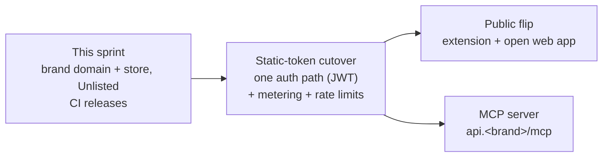

# Brand domain, Chrome Web Store, MCP server — program plan

**Status: PLAN, awaiting operator approval. Nothing here is built.**
Investigated 2026-09-26. Spot-checked against `main` (`03b72cda`) and production on 2026-10-03
(§ 11 lists what moved in between).

| | |
| --- | --- |
| **Asked for** | (1) Move the app to a branded custom domain. (2) Publish the Chrome extension to the Chrome Web Store so anyone can install it and it updates itself. (3) Later: an MCP server, so AI agents can use the platform. |
| **Answer in one line** | One sprint puts the app on the brand domain and the extension in the store as **Unlisted** with releases driven by CI. Going **Public** waits for the static-token cutover. The MCP server fits without changing this plan and follows that cutover. |
| **Operator runbook** | Click-by-click steps with copy-ready values: <https://claude.ai/artifact/PTzqcTxxTj2nL5476WZRon> (private to the operator's Claude account). This file is the durable summary; the runbook is the checklist. |
| **Evidence** | Four read-only repo audits, six documentation research reports, ten adversarial fact-checks, one adversarial review of the plan itself. Provenance in § 12. |

Terms used once and then assumed: **origin** = scheme + host of a site (`https://app.example.cz`);
**CORS** = the browser rule that lets one origin call another only if the callee allows it;
**JWT** = the signed login token Supabase issues per user; **RLS** = row-level security, the
database rule that scopes each row to its account; **MCP** = Model Context Protocol, the standard
by which AI agents (Claude, ChatGPT, Cursor) call a product's tools.

---

## 1. North star

**Hostnames live in DNS and dashboards, never in code or manifests. The store, not a download,
delivers the extension. One name, one origin per surface, one extension identity.**

Four corollaries decide every wave:

1. The extension manifest contains no deployed hostname.
2. The Chrome Web Store owns the extension's identity and its update channel.
3. Every origin change is a variable or dashboard edit plus one Deploy click.
4. No flag, no dual mode. The one transitional overlap (old and new origins, old and new
   extension IDs) has a dated end.

The code already meets the first half: no hostname is hardcoded in the SPA or the API. Every host
comes from Railway variables, GitHub secrets, or the Supabase dashboard. Moving the SPA's own
domain needs **zero code and zero rebuild**. Only the API host change forces one SPA rebuild and
one extension rebuild.

## 2. Sequencing across programs

Two facts fix this order.

**Domain before store.** The store listing needs a public privacy policy on the brand domain, the
extension links into the app, and reviewers see the brand. Anything hostname-shaped that reaches
the store in the first version becomes a permission prompt later: Chrome disables an updated
extension until each user re-approves a new host.

**Public is gated by the static-token cutover.** A public extension needs open sign-up (extension
sign-in is Supabase Google sign-in). Every extension user then also gets the full web app: the
default plan grants all agendas and the login guard checks only for a session. The web app's
bundle, served before login, still contains the static API token (`VITE_API_TOKEN`; re-confirmed
in the live bundle on 2026-10-03). That token opens the `require_token` routes with no account,
including routes that spend money on LLM calls and routes whose data is not scoped per account.
This posture is already documented in `docs/design/api-token-rotation-and-spa-jwt-migration.md`
and `docs/design/waves-1-4-public-features.md`; a brand domain and a store listing only end the
obscurity it relied on. The route-level census is kept out of this public file (§ 12).

The cutover is mostly subtraction: on 2026-09-26, 24 of the 56 static-token routes had no caller
in the repo. The recommendation is therefore: **this sprint ends at Unlisted** (install by link,
auto-updating, CI releases), and the Public flip is the first act of the cutover sprint. The
operator can overrule and flip early; the exposure is then accepted knowingly.

Three cheap safeguards belong in this sprint regardless, because the token becomes easier to find
as soon as brand certificates appear in public certificate logs (W1) and the store page links the
app (W5): hard spend caps in every LLM provider console and on the Mapy.cz key; deletion of the
static-token routes nothing calls; and, optionally, public sign-up switched off while the listing
is Unlisted.

## 3. What the repo's own docs get wrong (validated)

| Claim in the repo | Verdict | How it was checked |
| --- | --- | --- |
| Publishing keeps the extension ID pinned by the manifest `key` | **False.** The store refuses a new upload whose manifest has `key` and assigns its own ID. | Two fact-checks; developer reports dated 2026-09-20 and 2026-09-25; Google's own procedure runs store → manifest |
| `CORS_ALLOW_ORIGINS` contains the extension origin | **False in production.** A preflight from the extension origin gets HTTP 400. The extension works only through host permissions. | Live request, 2026-09-26 and 2026-10-03 |
| Both the API and Supabase origins must be host permissions | **False.** Supabase Auth answers any origin. A background worker with empty host permissions calls the API under normal CORS. | Two fact-checks, one with a live Chrome 151 test; Starlette echoes requested headers on preflight |
| The extension's redirect URL must be registered in the Google OAuth client | **False.** Google only ever sees Supabase's callback. Only Supabase's redirect allowlist needs it. | Code path in `chrome-extension/src/auth.ts` |
| Railway redeploys when a variable changes | **False.** Edits are staged; someone clicks Deploy. | Railway docs, 2026 |
| Auth emails work, just unbranded | **Unproven and almost certainly false.** No confirmation or reset email has ever been sent; Supabase's built-in mailer refuses addresses outside the project team. | Aggregate read of `auth.users`; Supabase docs. SMTP settings are dashboard-only — verify there. |
| The web app is operator-only behind a password gate | **False.** The bundle is served to anyone and sign-up is open. | Live settings endpoint; `frontend/Caddyfile` |
| CI publishing needs four secrets | **Outdated.** Store API v1 shuts down 2026-10-15; v2 also needs a publisher ID. | Chrome Web Store API docs |
| The manifest is uploadable as is | **False.** The description is 191 characters; the limit is 132. | `chrome-extension/manifest.json` |

Still present on `main` as of 2026-10-03: `chrome-extension/README.md` (Google redirect step,
four-secret plan, CORS section), `docs/architecture.md` (extension ID and CORS claims),
`.claude/skills/toolkit-api/SKILL.md` (CORS line), `frontend/.env.example` ("password gate").
Each is corrected in the PR that changes the governed behaviour.

## 4. Waves

Operator steps are summarized here; the runbook has the click paths. "PR" means a pull request
opened by the coding session.

| Wave | Owner | Effort | Exit gate |
| --- | --- | --- | --- |
| **W0** Decisions and accounts | Operator | 1–2 days incl. waits | § 7 answered; accounts exist |
| **W1** Domain cutover | Operator + 3 small PRs | half a day + DNS and certificate waits | Both hosts serve with a padlock; sign-in works on the new domain; the bundle carries the new API host |
| **W2** Public pages | 1 frontend PR + operator sign-off | 1 day | `/privacy` opens without login; favicon shows |
| **W3** Auth email | Operator | half a day + DNS wait | **Deferred by default.** A confirmation and a reset email reach a non-team address |
| **W4** Extension store-ready | 1 extension PR, then 1 release-job PR | 2–3 days | A build with empty host permissions signs in and looks up an ad against production |
| **W5** Store submission | Operator, texts and images prepared | 1 day + review | Installed from the store link, signed in, panel visible |
| **W6** Decommission | Operator + docs PR | 4 weeks after first approval | One origin per surface, one extension ID everywhere |

### W0 — Decisions and accounts

- Domain on Cloudflare DNS (the account exists for R2). When moving nameservers: check the
  imported MX/SPF/DKIM/TXT records, and turn DNSSEC off at the registrar first.
- Railway plan must be Hobby or Pro; Free has no custom domains.
- Chrome Web Store developer account on a **dedicated company mailbox**: the email can never be
  changed and one account creates one publisher for life. 2-Step Verification on; one-time fee of
  about US$5. Declare **Trader** (Limen Ventures acts commercially): legal name, registered
  address, and an SMS-capable company phone are shown publicly on the listing.
- A **separate** Google Cloud project for the store API, audience Internal. Never change the
  audience of the project that holds Supabase's Google sign-in client: Internal there would lock
  every non-Workspace Google account out of the app and the extension.
- A dedicated **reviewer Google account**. The extension signs in with Google only, so store
  reviewers cannot use an email/password login.
- Hard spend caps in each LLM provider console and on the Mapy.cz key.

### W1 — Domain cutover (nothing is deleted until W6)

1. Railway custom domains `api.<brand>` and `app.<brand>`, each with **two** DNS records (CNAME
   and a TXT verification record), DNS-only. `api` stays DNS-only permanently: Cloudflare's proxy
   cuts responses at 125 s and agent estimations run about four minutes.
2. API variables: `CORS_ALLOW_ORIGINS` gains the new app origin (old one stays);
   `SPA_BASE_URL`, `API_PUBLIC_URL` → Deploy. A preflight from both app origins confirms it.
3. Supabase URL configuration: read the current values; add the **old** Railway origin to the
   redirect allowlist explicitly; then switch the Site URL to the new app origin. The old origin
   is probably allowed only because it is today's Site URL.
4. SPA variable `VITE_API_BASE_URL` → Deploy; confirm the build actually ran.
5. Verify in a private window. Everyone is signed out once on the new origin.
6. GitHub secrets `EXT_API_BASE_URL`, `EXT_APP_BASE_URL`.
7. PRs: domain (smoke-check default host, dead example hosts); cleanup (dead build argument,
   dead env lines); safeguard (delete the static-token routes nothing calls — after the operator
   confirms no ClickUp automation or personal script uses the token).

### W2 — Public pages on the brand domain

One registry route `/privacy`, declared top-level beside `/login` (outside the login guard), one
page that reads the brand name from `frontend/src/lib/brand.ts`. The stale footer text is replaced
by the privacy link. The login screen gets the brand mark and one shared set of form styles. One
icon set in `frontend/public/` serves both the SPA favicon and the extension build. The privacy
policy is drafted in Czech and English from the audited data flows; the operator or a lawyer signs
off. Supabase runs in Ireland (eu-west-1); the policy must say so.

### W3 — Auth email (deferred by default)

Resend sending domain `mail.<brand>` with SPF, DKIM and DMARC records; Supabase custom SMTP via
Resend; Czech templates. Not on the store's critical path: the extension is Google-only and this
sprint ends at Unlisted. It becomes required when the web app opens email sign-up to the public.

### W4 — Extension: store-ready manifest, then releases through the store

Extension PR:

- Manifest description under 132 characters; host permissions left empty and the build-time
  stamping deleted, so the manifest carries no hostname.
- **The pinned `key` stays** in the repo for now. Without it every unpacked or PR build gets a
  random ID that cannot sign in. The store never receives a key: the release job strips it. After
  the first upload the store's public key replaces the pinned one, so every build shares the
  store's ID.
- Portal hosts trimmed to the nine that serve pages (seven entries only redirect). The install
  warning shrinks from sixteen sites to nine.
- Permissions: drop `alarms` (the token is refreshed before every call; the timer signs users out
  after a network blip). Replace `webNavigation` — the only permission with an alarming warning —
  with navigation detection inside the page script, kept only if a live test fails.
- A permission ratchet test: the built manifest's permissions and site list are compared with a
  committed snapshot, so nothing can grow them (and disable every install) silently.
- Sourcemaps off; code stays unminified, which reviews faster.

Before it merges the operator adds the current extension origin to `CORS_ALLOW_ORIGINS`, so the
empty-host-permissions build can be verified against production.

Release-job PR, merged only after the store credentials exist (W5):

- Same workflow file, never renamed: the version's patch number is the workflow run number.
- A merge to `main` or a manual run publishes through the store API **v2** with `curl` (no new
  dependency), key stripped from the zip.
- Publishes only when the item is Published or has no submission. Skips on Pending review or
  Staged. Fails loudly on Rejected, taken down or warned and never resubmits. Polls the
  asynchronous upload. One concurrency group.
- Trigger paths cover the extension sources and every shared file it imports; documentation
  changes do not trigger a release.
- Standing rule from then on: **API changes the extension relies on stay additive** until the
  store has published the version that stopped needing the old shape. Reviews take days and every
  installed copy runs the old build meanwhile.

### W5 — Store submission

1. First upload by hand (the API cannot create an item).
2. Note the store's Item ID and Publisher ID. **Before** submitting for review, register the new
   ID in two places: Supabase's redirect allowlist and the API's `CORS_ALLOW_ORIGINS`. Google
   Cloud needs nothing.
3. Listing in Czech, icon, screenshots (1280×800), small promo tile, privacy URL, single-purpose
   statement, per-permission justifications, data-use disclosure (personal information,
   authentication information, web history, website content), "no remote code".
4. Visibility **Unlisted**. Test instructions carry the reviewer Google account.
5. CI credentials from the separate Google Cloud project; five `CWS_*` secrets; then the
   release-job PR merges.
6. After approval the operator installs from the store and removes the unpacked copy.
7. Public flip, later and gated: pause the release job, change visibility, wait for the second
   review, publish once by hand, re-enable the job.

### W6 — Decommission

Re-point any Stripe or Resend webhook registered on the old API host. Remove the old app origin
from CORS and Supabase, the old extension ID from Supabase and CORS, the unused redirect entry
from the Google client, and finally the two `*.up.railway.app` domains (irreversible).

## 5. MCP server

**Verdict: it fits. No wave above changes.** It is one module mounted on the existing API service
at `https://api.<brand>/mcp`, using the official Python SDK (`mcp` 2.x). No new Railway service,
no new domain, no new host in the extension's install warning.

Why it fits:

- The toolkit has 22 facts-only tools with one return envelope. The estimation agent's registry
  (`api/agent.py`, 14 tools) already holds names, descriptions and JSON schemas. Promoted to a
  transport-neutral registry, it serves both the agent loop and MCP: one registry, two transports.
- Under the current MCP specification (2026-07-28) the server is an OAuth resource server and the
  authorization server may be separate. **Supabase Auth's OAuth 2.1 server** fills that role. Its
  tokens are ordinary Supabase JWTs, so the existing JWT verification, tenant pool and RLS accept
  them unchanged. The consent screen is a page on the app (`/oauth/consent`), so agent users see
  the brand.
- Claude, ChatGPT, Cursor and VS Code all connect through OAuth against a separate authorization
  server. None depends on API keys in headers. MCP gets no static-token path, which is the same
  direction as the token cutover.

What it needs, and where it lands:

| Need | Why | Lands in |
| --- | --- | --- |
| JWT verifier checks the issuer and distinguishes agent tokens (they carry a `client_id`) | Today it checks signature, audience and expiry only; an admin's agent token would reach every admin route. Supabase does not bind tokens to the MCP server. | Token-cutover sprint |
| Metering on tool calls | The entitlement gate exists but is attached to no route; LLM calls outside estimations carry no account. | Token-cutover sprint |
| Rate limiting | The MCP specification requires it; the API has none. | Token-cutover sprint |
| Estimations as submit-then-poll tools | Claude's hosted tool limit is 240 s, the same as an agent run. Uses the realtime worker's estimation lane. | MCP sprint |
| `mcp` as an estimation source, stamped by the server | The source value is client-supplied today. | MCP sprint (additive migration) |
| A one-day spike first | Supabase's OAuth server is in beta, is disabled on the project today, has no support for the newer client-registration method, and has open defects that affect MCP clients. If a client is blocked, only the token verifier changes. | MCP sprint, day one |

Consequences for this plan: the MCP URL is fixed as `api.<brand>/mcp`, so it launches only after
W1. The Supabase custom domain (§ 7, question 4) stays deferred for a second reason: it does not
rebrand the OAuth endpoints and would break agent discovery if advertised as the issuer. One
static-token route, the comparables tool, is kept by the operator's ruling of 2026-09-21 for
outside automations until the MCP server offers the same tool. `ROADMAP.md` still lists the MCP
server as out of scope; opening a track is part of the MCP sprint.

Estimated at one to two weeks after the token cutover.

## 6. Costs and elapsed time

| Item | Cost | Note |
| --- | --- | --- |
| Brand domain | registrar price | not yet chosen |
| Cloudflare DNS | free | |
| Railway custom domains | included from Hobby ($5/month) | current plan unverified |
| Chrome Web Store registration | about US$5, once | |
| Supabase OAuth server (MCP) | free; sign-ins count as monthly active users | beta |
| Resend (W3, deferred) | free tier, or $20/month | |
| Supabase custom domain (question 4, deferred) | about $10/month | |

Elapsed time to "Unlisted and auto-updating" is dominated by waits, not work: trader verification
(no published duration), DNS and certificates (hours), and store review (officially a few days,
up to weeks for a new developer; Google reported a return to baseline on 2026-08-20 after a
backlog of about four weeks in April). Coding effort is roughly one week across four small PRs.

**Hard date:** the store's v1 API stops on 2026-10-15. It affects only how the release job is
written (v2 from day one); nothing is live on v1.

## 7. Decisions needed

Each has a default that applies if the operator says nothing.

1. **Domain, hosts, DNS.** Which domain; is it owned; which registrar? *Default:* `app.<brand>`
   and `api.<brand>`; the bare domain redirects to the app; DNS on Cloudflare.
2. **Launch scope and sign-up.** *Default:* Unlisted now; Public after the token cutover; spend
   caps and dead-route deletion in this sprint; sign-up left open. *Alternative:* sign-up switched
   off while Unlisted, testers created by hand.
3. **Sign-in methods and W3.** *Default:* keep Google and email/password in the code; defer W3.
   The extension is Google-only either way.
4. **Google sign-in screen branding.** *Default:* defer. Branding needs the Supabase custom domain
   plus Google brand verification, which requires a public homepage that is more than a login page.
5. **Permissions and portals.** *Default:* drop `alarms`; drop `webNavigation` if the live test
   passes; nine portal hosts; no English bezrealitky site.
6. **Privacy policy.** *Default:* drafted in Czech and English naming Limen Ventures; operator or
   lawyer signs off before submission.

For the MCP sprint, later: which tool surface goes first (read-only market tools, account tools,
estimations), and how agent tokens are told apart (a token hook, or the simpler `client_id` check).

## 8. Subtraction ledger

**Deleted:** build-time host permissions and their helper · the `alarms` permission and its
refresh timer · the `webNavigation` permission and its message plumbing (gated) · seven
redirect-only portal hosts · hand-copied name and host list in the manifest template · sourcemaps
in the store build · the build-info step · the downloadable build as the production install path ·
README sections for the static token, self-hosted `.crx`, the dual CORS/host mechanism, the Google
redirect step and the three-places ID warning · secrets `EXT_API_TOKEN` and
`SUPABASE_SERVICE_ROLE_KEY` with two dead workflow env lines · the dead `VITE_R2_PUBLIC_BASE`
build argument · the unused redirect entry in the Google client · the stale footer text · two
duplicated login-form style sets · three duplicate icon files · the static-token routes nothing
calls · the old Railway origins and every allowlist entry naming them.

**Added:** one store-publish job in the existing workflow · five `CWS_*` secrets · one privacy
route and page · one shared icon set with one favicon link · in-page navigation detection · one
permission ratchet test · the store ID in two allowlists (Supabase redirect, API CORS) · two
custom domains.

**Net:** permissions four → two; sites in the install warning sixteen → nine, with no API or
database host among them; one install path, one release path, one extension identity. The
extension ID sits in two allowlists instead of one. That is the accepted price for a manifest
with no hostname in it.

## 9. Risks

| Risk | Handling |
| --- | --- |
| Store review rejects the item | Short description; narrow host list; justifications drafted; new ID registered before submission; working reviewer login |
| Sign-in from the store build never returns | The new redirect address is missing from Supabase's allowlist. Hard checklist item in W5. |
| Empty host permissions break API calls | Only if CORS lacks the extension origin. Verified by preflight and a full sign-in plus lookup before publishing. |
| Railway reuses an old image after a variable change | Check the build log; Redeploy if "Skipped Builds" is on |
| Certificate lockout | Never delete and re-add a domain to retry |
| CI publishes at the wrong moment | State handling in § 4 W4 |
| A release breaks installed copies | Additive-API rule; permission ratchet test |
| CI refresh token expires weekly | Separate project with audience Internal, never Testing |
| Company phone and address become public | Trader rule; use a company line and the registered address |
| Supabase OAuth beta blocks an agent client (MCP) | One-day spike first; fallback changes only the verifier |

## 10. Out of scope

The static-token cutover itself (next sprint; the gate for Public) · notification emails beyond
auth SMTP · Stripe · the Supabase custom domain and Google brand verification · a marketing
homepage · Terms of Service · renaming Railway services or internal packages.

## 11. What changed between 2026-09-26 and 2026-10-03

| Change | Effect on the plan |
| --- | --- |
| #1663 — required CI checks now run on every PR | The W0 step "fix branch protection" is dropped; docs and frontend PRs merge normally. |
| #1683 — estimation trace and feedback routes moved to the login token | Static-token routes 56 → 54; that cross-account read is closed. The gate stands: the token is still in the live bundle. |
| #1690 — extension gained pipeline, collection and hide controls on search-page cards (manifest 0.10.0) | The store data-use disclosure, screenshots and the permission snapshot must be drafted from the build that ships. Re-audit at W4. |
| #1666 — docs sweep | CLAUDE.md now states the Ireland region. The extension README, architecture doc and skill still carry the claims in § 3. |
| Unchanged, re-verified live | Extension origin still refused by CORS; sign-up open; Supabase OAuth server disabled; manifest description 191 characters; `key` present; no `/privacy` route; `ROADMAP.md` lists MCP as out of scope. |

The caller-less route list (24 on 2026-09-26) must be re-derived at delivery.

## 12. Provenance

The plan was produced by read-only investigation on 2026-09-26: repo audits of the hostname
surfaces, the extension, the SPA's public surface, and the static-token routes; documentation
research on Railway domains, the Chrome Web Store, Supabase and Google branding, the MCP
authorization specification, Supabase's OAuth server, and the MCP Python SDK; adversarial
fact-checks of the load-bearing claims; and one adversarial review of the plan, whose fifteen
findings are folded in above (the three blockers were the Google project audience, the reviewer
account, and keeping the manifest key).

Raw investigator outputs are local to the operator's machine, in the Claude session transcripts
under `~/.claude/projects/-home-hejtm-dev-sreality/776a9025-cbc9-49b4-bf41-d1e5042a52bd/subagents/workflows/`
(`journal.jsonl` in `wf_2d50b73d-e1b`, `wf_f90c886f-1c8`, `wf_0fd11ef5-e52`; two agent transcripts
in `wf_612168c4-f7e`). The route-level static-token census is deliberately not reproduced in this
public repository; its summary lives in the session memory notes
`domain-and-cws-investigation-2026-09-26` and `mcp-server-fit-assessment-2026-09-26`.
